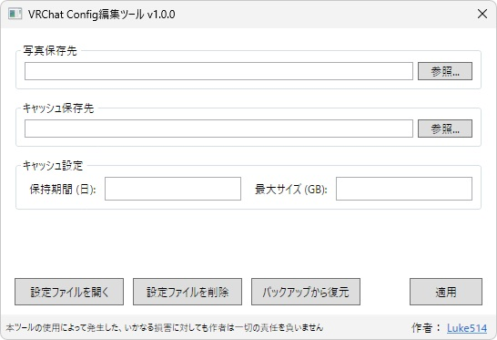
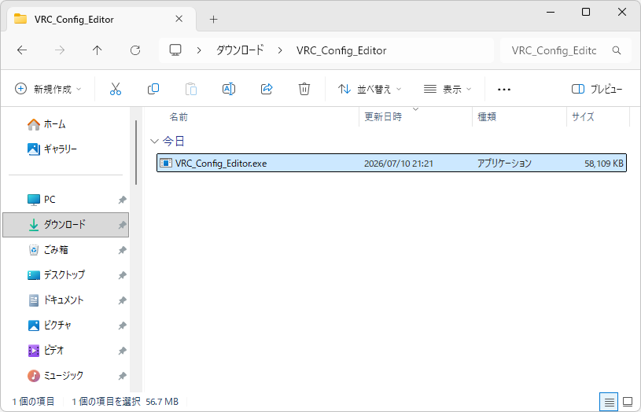
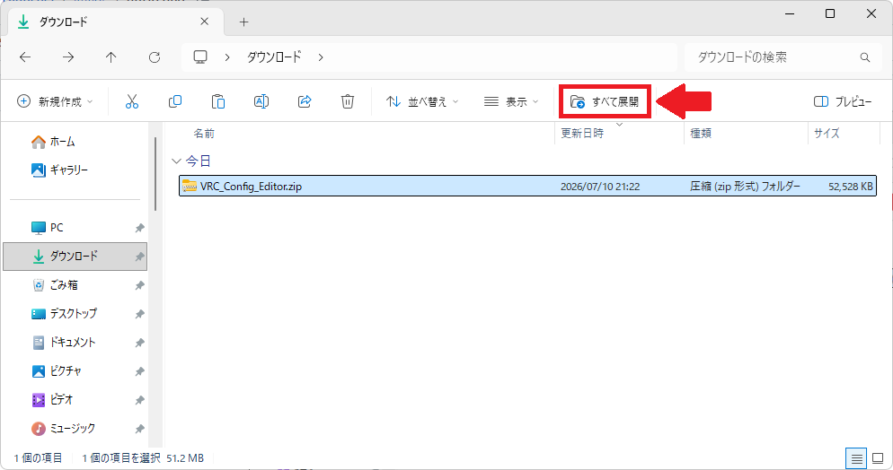
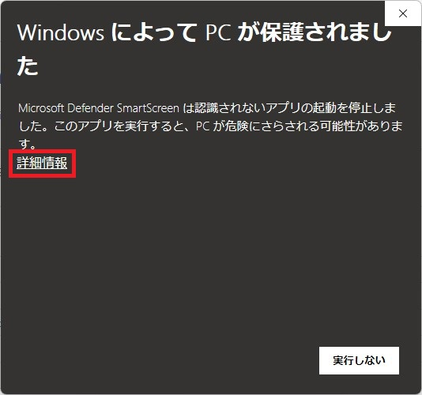

# これは何をするためのもの？
VRChatの写真・キャッシュの配置場所や、キャッシュ保持設定などを変更する設定ファイル(config.json)を  
自動で作成し、配置するツールです  
  
  
  
# 主な機能
・写真の保存先を変更  
・キャッシュの保存先を変更  
・キャッシュの保持期間、最大サイズを設定  
・設定ファイルの自動バックアップ  
・バックアップから設定を復元  
・設定ファイルの削除  
  
# ツールのダウンロードと起動
1.&nbsp;[**Releases**](https://github.com/Luke-514/VRChat-Config-Editor/releases/latest)からツールのZipファイル(VRC_Config_Editor.zip)をクリックしてダウンロードします  
  
&emsp;  
  
2.&nbsp;任意の場所でZipファイルを展開し、VRC_Config_Editor.exeを起動してください  
&emsp;  
  
# 利用上の注意(共通)
> [!CAUTION]  
>・VRChatを起動している状態で設定を適用した場合は、再起動後に設定が反映されます。
  
# ツールの使い方
1.&nbsp;変更したい項目を編集します  
&nbsp;&emsp;  
  
2.&nbsp;適用を押すと設定ファイルが編集されます  
&nbsp;&emsp;  
  
3.&nbsp;設定ファイルを手動で編集したい場合は、設定ファイルを開くを押してください  
&nbsp;&emsp;  
  
4.&nbsp;設定ファイルを削除したい場合は、設定ファイルを削除を押してください  
&nbsp;&emsp;(削除前に自動でバックアップが作成されます)  
&nbsp;&emsp;  
  
5.&nbsp;バックアップされた設定に戻したい場合は、バックアップから復元を押して、  
&nbsp;&emsp;戻したい日時のファイルを選択してください  
&nbsp;&emsp;  
  
# よくある質問
Q.&nbsp;ツールが起動しない  
A.&nbsp;Zipファイルを展開してからご利用ください  
&emsp;  
  
Q.&nbsp;ツールを起動するとWindows Defenderに止められる  
A.&nbsp;詳細情報を押すと出てくる実行ボタンを押してください  
&emsp;
  
  
Q.&nbsp;既に設定ファイル(config.json)がある場合はどうなるの？  
A.&nbsp;設定が追記されます  
  
Q.&nbsp;上記いずれでも解決しない問題がある  
A.&nbsp;アンチウイルスソフトの例外リスト等への登録と、管理者権限での起動を試してみてください  
  
Q.&nbsp;バグを見つけた！  
A.&nbsp;[お問い合わせ](https://lukesplaygrounds.com/about/)から使用しているツールのバージョンと  
&nbsp;&emsp;発生している症状をご連絡いただけますと幸いです  
  
# 利用規約
許可  
・個人利用  
・SNSや動画、ブログでの紹介  
&emsp;(掲載連絡は不要ですが、当ページのリンク(直ダウンロードリンクは禁止)を貼ってください)  
  
禁止  
・商用利用  
・二次配布  
・譲渡  
・改造  
・リバースエンジニアリング  
・逆コンパイル  
・コードの転用  
  
特記  
利用規約に違反された場合は利用料、賠償金をお支払いいただきます  
  
※本規約は予告なく変更されることがあります  
  
# 免責事項
本ツールは現状のまま提供されます。作者は本ツールの機能、性能、正確性について一切の保証を行いません。  
本ツールは予告なく仕様変更、配布中止、更新停止を行うことがあります。  
This tool is provided "as is." The author makes no warranties whatsoever regarding the functionality, performance, or accuracy of this tool.  
This tool may be subject to specification changes, discontinuation of distribution, or cessation of updates without prior notice.  
  
作者は、付随的損害、間接損害、特別損害、将来の損害、逸失利益にかかる損害、およびデータの消失について、賠償の責任を負わないものとします。  
利用者に損害が生じた場合、作者に故意または重過失がある場合を除き、利用者に現実に生じた直接かつ通常の損害に限り、賠償責任を負うものとします。  
The author shall not be liable for incidental damages, indirect damages, special damages, future damages, lost profits, or loss of data.  
In the event of damage to the user, the author shall only be liable for direct and ordinary damages actually incurred by the user,  
except in cases of willful misconduct or gross negligence on the part of the author.  
  
# 作者
Luke514  
X：@rx_luke  
  
[お問い合わせ](https://lukesplaygrounds.com/about/)  
  
# 寄付
  
or  
[Booth](https://luke514.booth.pm/items/8340211)
